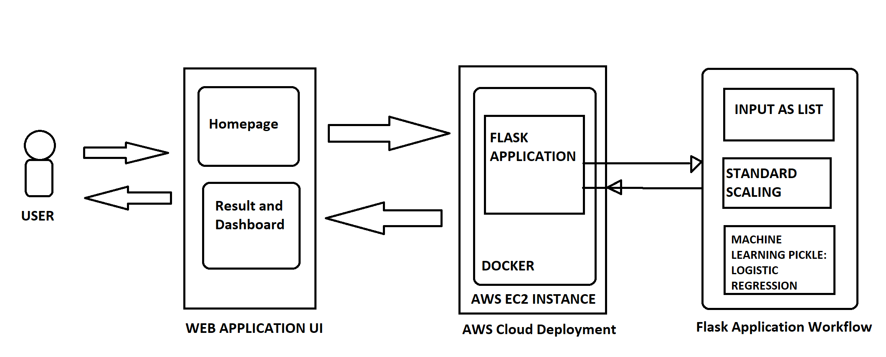

# Startup Success Web Application

The data for this project is taken from,
https://www.kaggle.com/mauriciocap/crunchbase2013

AWS Deployment-
Startup Success Predictor:
http://ec2-3-16-188-11.us-east-2.compute.amazonaws.com:5000/

Data.Viz https://public.tableau.com/profile/aishwarya.bansode#!/vizhome/Healthcarecrowdfunding/Dashboard2 

### About

The main aim of the project was to give the probability of success of the startup to elevate revenue growth. We found the companies within the last decade which had raised more than one round of funding. Status of the company which includes IPO, Acquired, Closed, Operating was changed to success and failure. After tunning the logistic regression model, the model was deployed on a flask application which was dockerized and hosted on AWS EC2 instance. With the thousands of companies from different domains, we considered one of them i.e Healthcare industries. we considered the following features for the prediction,

1) Total Funding (USD)
2) Funding Rounds
3) Time Between First Round
4) Avg Raised USD
5) Avg Time Between Rounds
6) Investor Counts
7) Type of Industry 
8) Regions (In USA)
9) Homepage URL (existing or not)

The entire workflow is shown below,



### Install

This project requires **Python 3** and the following Python libraries installed:

- [Logistic Regression](https://scikit-learn.org/stable/modules/generated/sklearn.linear_model.LogisticRegression.html)
- [Support Vector Machine](https://scikit-learn.org/stable/modules/svm.html)
- [xgboost](https://xgboost.readthedocs.io/en/latest/)
- [Random Forrest](https://scikit-learn.org/stable/modules/generated/sklearn.ensemble.RandomForestClassifier.html)
- [Pickel](https://docs.python.org/3/library/pickle.html)
- [Flask](https://flask.palletsprojects.com/en/1.1.x/)
- [scikit-learn](https://scikit-learn.org/stable/)
- [pandas](https://pandas.org/)
- [nltk](https://nltk.org/)
- [Matplotlib](https://matplotlib.org/)

Make sure you have [Jupyter Notebook](http://ipython.org/notebook.html) installed.

You could just install [Anaconda](http://continuum.io/downloads) distribution of Python, which already has the above packages and more included. 

Also, you need to have an account on Amazon Web Service [AWS](https://aws.amazon.com/console/) so that you can host on EC2.

### Files

There are two main notebooks, one is the cleaning notebook, where the data is cleaned and prepared for modeling and the other is the modeling notebook where the ML models and the model performance are compared,

```bash
Data_Cleaning1.ipynb
```  
and
```bash
Data_Modelling2.ipynb
```
Web app folder contains the flask application and the Docker folder contain the docker file and requirements.txt file.

### Results 
Here is the web application which takes the parameter and tells us the prediction probability and the factors on which it calculates is shown in the dashboard.


RESULTS-


